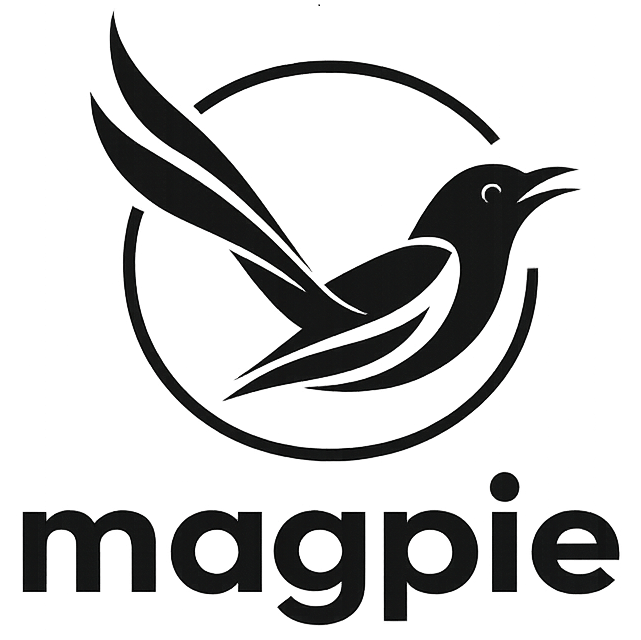

<p align="center">
  
</p>

<h1 align="center">MAGPIE.js</h1>
<p align="center"><em>Message Abstraction & General-Purpose Integration Engine — TypeScript/JavaScript</em></p>

<p align="center">
  <a href="https://www.npmjs.com/package/@luxai-qtrobot/magpie">
    
  </a>
  <a href="https://www.npmjs.com/package/@luxai-qtrobot/magpie">
    
  </a>
  <a href="https://www.npmjs.com/package/@luxai-qtrobot/magpie">
    
  </a>
</p>

---

MAGPIE.js is the TypeScript/JavaScript port of [MAGPIE](https://github.com/luxai-qtrobot/magpie) — a lightweight, transport-agnostic messaging engine for distributed systems. It provides clean abstractions for pub/sub streaming and request/response RPC, with two fully implemented transports: **MQTT** (browser + Node.js) and **WebRTC** (browser).

Designed for **full wire-level interoperability** with the Python (`luxai-magpie`) and C++ (`libmagpie`) implementations — a browser client can talk directly to a Python or C++ MAGPIE node with no adaptation layer.

---

## Features

- **Pub/Sub streaming** — topic-based messaging via `StreamWriter` / `StreamReader`
- **Request/Response RPC** — async-native RPC via requester/responder pairs
- **MQTT transport** — full pub/sub and RPC over MQTT; supports `mqtt://`, `mqtts://`, `ws://`, `wss://`, auth, LWT, and auto-reconnect
- **WebRTC transport** — peer-to-peer pub/sub, RPC, video, and audio directly in the browser; uses MQTT as the signaling channel
- **Pluggable transports** — same `StreamReader` / `StreamWriter` / `RpcRequester` / `RpcResponder` interfaces across all transports
- **Fast serialization** — msgpack by default; bring your own serializer via the abstract interface
- **Typed frames** — `DictFrame`, `ImageFrameJpeg`, `AudioFrameRaw`, and more — wire-compatible with Python
- **Browser + Node.js** — one package, works everywhere; MQTT works on both, WebRTC is browser-native
- **CDN ready** — single UMD bundle, no bundler required

---

## Installation

### npm

```bash
npm install @luxai-qtrobot/magpie
```

### CDN (no bundler required)

```html
<script src="https://cdn.jsdelivr.net/npm/@luxai-qtrobot/magpie/dist/magpie.umd.js"></script>
```

All exports are available under the global `Magpie` object:

```js
const { MqttConnection, MqttPublisher, MqttSubscriber, WebRtcConnection, WebRtcSubscriber } = Magpie
```

---

## Quick Start — MQTT

### Pub / Sub

**Publisher:**

```typescript
import { MqttConnection, MqttPublisher } from '@luxai-qtrobot/magpie'

const conn = new MqttConnection('mqtt://broker.hivemq.com:1883')
await conn.connect()

const pub = new MqttPublisher(conn)
await pub.write({ sensor: 'temp', value: 22.5 }, 'sensors/temperature')

pub.close()
await conn.disconnect()
```

**Subscriber:**

```typescript
import { MqttConnection, MqttSubscriber, TimeoutError } from '@luxai-qtrobot/magpie'

const conn = new MqttConnection('mqtt://broker.hivemq.com:1883')
await conn.connect()

const sub = new MqttSubscriber(conn, { topic: 'sensors/temperature' })

while (true) {
  try {
    const [data, topic] = await sub.read(5.0)
    console.log(topic, data)
  } catch (err) {
    if (err instanceof TimeoutError) continue
    break
  }
}

sub.close()
await conn.disconnect()
```

Wildcard topics are fully supported:

```typescript
// single-level wildcard
const sub = new MqttSubscriber(conn, { topic: 'sensors/+/temperature' })

// multi-level wildcard
const sub = new MqttSubscriber(conn, { topic: 'sensors/#' })
```

---

### Request / Response RPC

**Requester:**

```typescript
import { MqttConnection, MqttRpcRequester, AckTimeoutError, ReplyTimeoutError } from '@luxai-qtrobot/magpie'

const conn = new MqttConnection('mqtt://broker.hivemq.com:1883')
await conn.connect()

const client = new MqttRpcRequester(conn, 'myrobot/motion')

try {
  const response = await client.call({ action: 'move', x: 1.0 }, 5.0)
  console.log('Response:', response)
} catch (err) {
  if (err instanceof AckTimeoutError)   console.error('No ACK — is the responder running?')
  if (err instanceof ReplyTimeoutError) console.error('No reply within timeout')
} finally {
  client.close()
  await conn.disconnect()
}
```

**Responder:**

```typescript
import { MqttConnection, MqttRpcResponder } from '@luxai-qtrobot/magpie'

const conn = new MqttConnection('mqtt://broker.hivemq.com:1883')
await conn.connect()

const server = new MqttRpcResponder(conn, 'myrobot/motion')

server.onRequest((request) => {
  console.log('Request:', request)
  return { status: 'ok', echo: request }
})
```

---

### Browser (CDN)

```html
<!DOCTYPE html>
<html>
<head>
  <script src="https://cdn.jsdelivr.net/npm/@luxai-qtrobot/magpie/dist/magpie.umd.js"></script>
</head>
<body>
<script>
  const { MqttConnection, MqttPublisher, MqttSubscriber } = Magpie

  // Browsers require WebSocket — use ws:// or wss://
  const conn = new MqttConnection('wss://broker.hivemq.com:8884/mqtt')
  await conn.connect()

  const pub = new MqttPublisher(conn)
  await pub.write({ hello: 'from browser' }, 'magpie/test')
</script>
</body>
</html>
```

> **Note:** Browsers cannot open raw TCP connections. Always use `ws://` (plain WebSocket) or `wss://` (WebSocket + TLS) in browser and React applications. Node.js supports all schemes including `mqtt://` and `mqtts://`.

---

### Advanced Connection Options

```typescript
import { MqttConnection, MqttOptions } from '@luxai-qtrobot/magpie'

const conn = new MqttConnection('wss://broker.example.com:8884/mqtt', {
  clientId: 'my-app-001',
  auth: {
    mode: 'username_password',
    username: 'user',
    password: 'secret',
    // mode: 'token' — pass a JWT or API key as username (e.g. Ably, HiveMQ Cloud)
  },
  will: {
    enabled: true,
    topic: 'devices/my-app-001/status',
    payload: 'offline',
    qos: 1,
    retain: true,
  },
  defaults: {
    publishQos: 1,
    subscribeQos: 1,
  },
  reconnect: {
    minDelaySec: 1,
    maxDelaySec: 30,
  },
})

await conn.connect()
```

> **mTLS note:** Client certificate authentication (mTLS) is not supported from browser JavaScript. Use `username_password` or `token` mode for browser clients. mTLS remains available in the Python and C++ MAGPIE implementations for backend-to-backend communication.

---

## Quick Start — WebRTC

WebRTC transport enables direct peer-to-peer communication between the browser and a Python or C++ MAGPIE node — with pub/sub messaging, RPC, and live video/audio streaming — all without routing data through a broker. MQTT is used only as the signaling channel to establish the WebRTC connection.

> **Browser only:** WebRTC uses native browser APIs (`RTCPeerConnection`). No extra dependencies are required, but this transport is not available in Node.js.

### Connect to a peer

```javascript
import { WebRtcConnection } from '@luxai-qtrobot/magpie'

// Connect via MQTT signaling — waits up to 60 s for the remote peer
const conn = await WebRtcConnection.withMqtt(
  'wss://broker.hivemq.com:8884/mqtt',  // MQTT broker used for signaling only
  'my-robot',                            // shared session ID — must match the Python side
  { reconnect: true }                    // auto-reconnect if the peer disconnects
)

const connected = await conn.connect(60)  // timeout in seconds
if (!connected) {
  console.error('Peer not reachable — is the Python side running?')
}
```

Start the Python peer with the same session ID:

```bash
# Python MAGPIE — any WebRTC-enabled tool, e.g. video capture
magpie-video-capture-webrtc \
  --broker wss://broker.hivemq.com:8884/mqtt \
  --session my-robot \
  --reconnect
```

---

### WebRTC Pub / Sub

Pub/sub over WebRTC uses a data channel. The API mirrors the MQTT transport exactly.

**Publisher:**

```javascript
import { WebRtcConnection, WebRtcPublisher } from '@luxai-qtrobot/magpie'

const conn = await WebRtcConnection.withMqtt('wss://broker.hivemq.com:8884/mqtt', 'my-robot')
await conn.connect(60)

const pub = new WebRtcPublisher(conn)
await pub.write({ action: 'greet', name: 'browser' }, 'magpie/demo')

pub.close()
await conn.disconnect()
```

**Subscriber:**

```javascript
import { WebRtcConnection, WebRtcSubscriber, TimeoutError } from '@luxai-qtrobot/magpie'

const conn = await WebRtcConnection.withMqtt('wss://broker.hivemq.com:8884/mqtt', 'my-robot')
await conn.connect(60)

const sub = new WebRtcSubscriber(conn, 'robot/state')

while (true) {
  try {
    const [data, topic] = await sub.read(5.0)
    console.log(topic, data)
  } catch (err) {
    if (err instanceof TimeoutError) continue
    break
  }
}

sub.close()
await conn.disconnect()
```

---

### WebRTC Request / Response RPC

**Requester:**

```javascript
import { WebRtcConnection, WebRtcRpcRequester, AckTimeoutError, ReplyTimeoutError } from '@luxai-qtrobot/magpie'

const conn = await WebRtcConnection.withMqtt('wss://broker.hivemq.com:8884/mqtt', 'my-robot')
await conn.connect(60)

const client = new WebRtcRpcRequester(conn, 'myrobot/motion')

try {
  const response = await client.call({ action: 'move', x: 1.0 }, 5.0)
  console.log('Response:', response)
} catch (err) {
  if (err instanceof AckTimeoutError)   console.error('No ACK — is the responder running?')
  if (err instanceof ReplyTimeoutError) console.error('No reply within timeout')
} finally {
  client.close()
  await conn.disconnect()
}
```

**Responder:**

```javascript
import { WebRtcConnection, WebRtcRpcResponder } from '@luxai-qtrobot/magpie'

const conn = await WebRtcConnection.withMqtt('wss://broker.hivemq.com:8884/mqtt', 'my-robot')
await conn.connect(60)

const server = new WebRtcRpcResponder(conn, 'myrobot/motion')

server.onRequest((request) => {
  console.log('Request:', request)
  return { status: 'ok', echo: request }
})
```

---

### WebRTC Video and Audio (browser)

When the remote Python peer sends a video or audio stream, receive it as a native `MediaStreamTrack` using the special sentinel topics `WebRtcSubscriber.VIDEO_TOPIC` and `WebRtcSubscriber.AUDIO_TOPIC`.

```javascript
import { WebRtcConnection, WebRtcSubscriber } from '@luxai-qtrobot/magpie'

const conn = await WebRtcConnection.withMqtt('wss://broker.hivemq.com:8884/mqtt', 'my-robot')

// Create subscribers before connect() to avoid missing early tracks
const videoSub = new WebRtcSubscriber(conn, WebRtcSubscriber.VIDEO_TOPIC)
const audioSub = new WebRtcSubscriber(conn, WebRtcSubscriber.AUDIO_TOPIC)

await conn.connect(60)

// Wait for the video track and attach it to a <video> element
const [videoTrack] = await videoSub.read(60)
const videoEl = document.getElementById('video-el')
videoEl.srcObject = new MediaStream([videoTrack])
await videoEl.play()

// Wait for the audio track and add it to the same stream
const [audioTrack] = await audioSub.read(60)
videoEl.srcObject.addTrack(audioTrack)
```

> **Autoplay policy:** Browsers mute autoplay by default. Set `<video muted>` initially and unmute on user interaction (e.g. a button click) to comply with browser autoplay policies.

---

### Advanced WebRTC Options

```javascript
import { WebRtcConnection } from '@luxai-qtrobot/magpie'

const conn = await WebRtcConnection.withMqtt(
  'wss://broker.example.com:8884/mqtt',
  'my-robot',
  {
    reconnect: true,           // auto-reconnect when the peer disconnects
    webrtcOptions: {
      stunServers: [],         // disable STUN — useful for purely local testing
      // stunServers: ['stun:stun.l.google.com:19302'],  // default
      turnServers: [
        { url: 'turn:turn.example.com:3478', username: 'user', credential: 'pass' }
      ],
      iceTransportPolicy: 'relay',   // force TURN relay (firewall-friendly)
    },
  }
)
```

---

## Frames

Frames are typed message wrappers that carry standard metadata (`gid`, `id`, `name`, `timestamp`) alongside the payload. They are wire-compatible with Python and C++ MAGPIE frames, and can be used with both MQTT and WebRTC transports.

```typescript
import { DictFrame, ImageFrameJpeg, AudioFrameRaw, Frame } from '@luxai-qtrobot/magpie'

// Create and publish a frame
const frame = new DictFrame({ value: { count: 1, msg: 'hello' } })
await pub.write(frame.toDict(), 'myrobot/data')

// Reconstruct a frame received from the wire
const [raw, topic] = await sub.read()
const frame = Frame.fromDict(raw as Record<string, unknown>)
// frame is automatically dispatched to the correct subclass (DictFrame, ImageFrameJpeg, etc.)
```

| Frame | Description |
|---|---|
| `DictFrame` | Arbitrary JSON-like dict payload |
| `BoolFrame` / `IntFrame` / `FloatFrame` / `StringFrame` | Primitive value wrappers |
| `BytesFrame` / `ListFrame` | Binary and list payloads |
| `ImageFrameRaw` / `ImageFrameJpeg` | Image data with width/height/channels metadata |
| `AudioFrameRaw` / `AudioFrameFlac` | PCM or FLAC audio with sample rate/channels metadata |

---

## Interoperability

MAGPIE.js shares the same wire format as the Python and C++ implementations across both transports:

- **Serialization:** msgpack (wire-compatible with Python's `msgpack.packb` / `msgpack.unpackb`)
- **RPC protocol:** identical message envelope (`rid`, `reply_to`, `payload`) on both MQTT topics and WebRTC data channels
- **WebRTC data channel envelope:** `{type: "pub"|"rpc_req"|"rpc_ack"|"rpc_rep", topic, payload}` — identical to Python
- **Frames:** identical field names and snake_case keys (e.g. `pixel_format`, `sample_rate`)
- **WebRTC signaling:** identical hello/offer/answer/ICE candidate flow — interoperable with `luxai-magpie[webrtc]` and `libmagpie-webrtc`

This means any combination of Python, C++, and JavaScript nodes can communicate directly — no bridges, no adapters.

**Cross-language examples:**

```bash
# Python WebRTC peer sends video → browser receives and displays it
magpie-video-capture-webrtc --broker wss://broker.hivemq.com:8884/mqtt --session my-robot --reconnect
# Open examples/browser/webrtc/video.html in the browser

# Python MAGPIE RPC responder → browser sends requests
python examples/mqtt_responder.py

# JS MQTT requester talks to Python responder
npm run example:requester
```

---

## Transport URI schemes

| Scheme | Protocol | Use case |
|---|---|---|
| `mqtt://host:1883` | Plain MQTT (TCP) | Node.js |
| `mqtts://host:8883` | MQTT over TLS (TCP) | Node.js (secure) |
| `ws://host:8000/mqtt` | MQTT over WebSocket | Browser (plain) |
| `wss://host:8884/mqtt` | MQTT over WebSocket + TLS | Browser (secure, recommended) |

WebRTC signaling uses the same MQTT WebSocket connection; the actual peer-to-peer data and media flow directly between browser and peer.

---

## Examples

### MQTT (Node.js)

| Example | Description |
|---|---|
| [`examples/mqtt_publisher.ts`](examples/mqtt_publisher.ts) | Publish messages at 1 Hz |
| [`examples/mqtt_subscriber.ts`](examples/mqtt_subscriber.ts) | Subscribe and print messages |
| [`examples/mqtt_requester.ts`](examples/mqtt_requester.ts) | Send RPC requests at 1 Hz |
| [`examples/mqtt_responder.ts`](examples/mqtt_responder.ts) | Echo RPC responder |

Run Node.js examples:

```bash
npm run example:publisher
npm run example:subscriber
npm run example:requester
npm run example:responder
```

### Browser demos

| Example | Description |
|---|---|
| [`examples/browser/demo.html`](examples/browser/demo.html) | MQTT interactive browser demo (pub/sub + RPC) |
| [`examples/browser/webrtc/messaging.html`](examples/browser/webrtc/messaging.html) | WebRTC messaging demo (pub/sub + RPC over data channel) |
| [`examples/browser/webrtc/video.html`](examples/browser/webrtc/video.html) | WebRTC video viewer (live video + audio + data channel) |

Build the bundle first, then open any demo directly in your browser:

```bash
npm run build
# open examples/browser/demo.html or examples/browser/webrtc/messaging.html in your browser
```

> **WebRTC demos:** These require a local HTTP server due to browser security policies (`file://` origins cannot use `RTCPeerConnection`). Serve the project root with any static server:
> ```bash
> npx serve c:/code/magpie-js
> # then open http://localhost:3000/examples/browser/webrtc/messaging.html
> ```

---

## Project Structure

```
src/
  serializer/       BaseSerializer, MsgpackSerializer
  frames/           Frame base + all frame types
  transport/
    StreamReader.ts       abstract subscriber interface
    StreamWriter.ts       abstract publisher interface
    RpcRequester.ts       abstract RPC client interface
    RpcResponder.ts       abstract RPC server interface
    mqtt/                 MQTT transport (browser + Node.js)
      MqttConnection.ts
      MqttPublisher.ts
      MqttSubscriber.ts
      MqttRpcRequester.ts
      MqttRpcResponder.ts
    webrtc/               WebRTC transport (browser only)
      WebRtcOptions.ts
      WebRtcSignaler.ts   WebRtcSignaler ABC + MqttSignaler
      WebRtcConnection.ts
      WebRtcPublisher.ts
      WebRtcSubscriber.ts
      WebRtcRpcRequester.ts
      WebRtcRpcResponder.ts
```

---

## Development

```bash
npm install        # install dependencies
npm run build      # build ESM, CJS, and UMD bundles
npm test           # run unit tests
npm run typecheck  # TypeScript type check only
```

---

## Related Projects

| Project | Language | Repository |
|---|---|---|
| MAGPIE | Python | [luxai-qtrobot/magpie](https://github.com/luxai-qtrobot/magpie) |
| MAGPIE C++ | C++ (`libmagpie`, `libmagpie-mqtt`) | [luxai-qtrobot/magpie-cpp](https://github.com/luxai-qtrobot/magpie-cpp) |
| MAGPIE.js | TypeScript/JavaScript | this repo |

---

## Project Status

**Status:** Beta — API is stable for both MQTT and WebRTC transport layers.

**Roadmap:**
- React hooks (`useMagpieSubscriber`, `useMagpieRequest`)
- gRPC-web transport
- Multi-transport routing

---

## License

Licensed under the [GNU General Public License v3 (GPLv3)](LICENSE).
