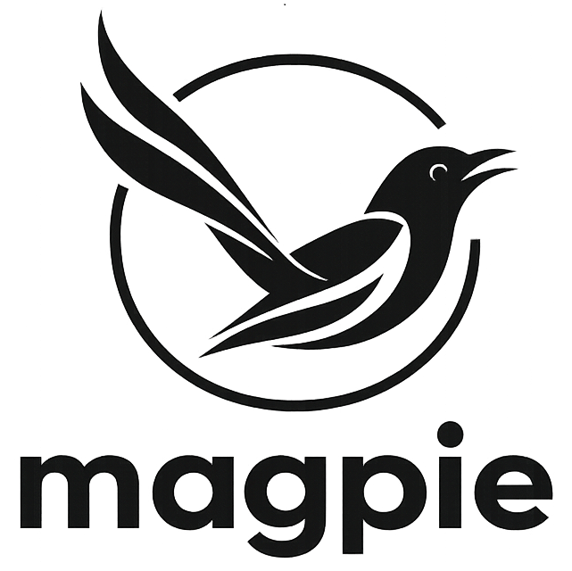

<p align="center">
  
</p>

<h1 align="center">MAGPIE.js</h1>
<p align="center"><em>Message Abstraction & General-Purpose Integration Engine — TypeScript/JavaScript</em></p>

<p align="center">
  <a href="https://www.npmjs.com/package/@luxai-qtrobot/magpie">
    
  </a>
  <a href="https://www.npmjs.com/package/@luxai-qtrobot/magpie">
    
  </a>
  <a href="https://www.npmjs.com/package/@luxai-qtrobot/magpie">
    
  </a>
</p>

---

MAGPIE.js is the TypeScript/JavaScript port of [MAGPIE](https://github.com/luxai-qtrobot/magpie) — a **transport-agnostic messaging and RPC framework for developers and AI agents**.

Whether the wire is MQTT or WebRTC, the application layer never changes. Services built with MAGPIE.js are natively consumable by both code and AI tools via built-in MCP support — making it a natural integration engine for distributed systems, edge devices, and AI-driven pipelines. Fully wire-compatible with the Python and C++ MAGPIE implementations.

---

## Table of Contents

- [Features](#features)
- [Installation](#installation)
- [Quick Start](#quick-start)
  - [MQTT Streaming](#mqtt-streaming)
  - [MQTT Request / Response RPC](#mqtt-request--response-rpc)
  - [MQTT Advanced Options](#mqtt-advanced-options)
  - [Browser (CDN)](#browser-cdn)
  - [WebRTC Streaming](#webrtc-streaming)
  - [WebRTC Request / Response RPC](#webrtc-request--response-rpc)
  - [WebRTC Advanced Options](#webrtc-advanced-options)
  - [WebRTC Video and Audio](#webrtc-video-and-audio)
  - [Schema-based RPC](#schema-based-rpc)
  - [MCP Integration](#mcp-integration)
- [Frames](#frames)
- [Interoperability](#interoperability)
- [Transport URI Schemes](#transport-uri-schemes)
- [Examples](#examples)
- [Project Structure](#project-structure)
- [Development](#development)
- [Related Projects](#related-projects)
- [License](#license)

---

## Features

- **One API, any transport** — `StreamWriter`, `StreamReader`, `RpcRequester`, `RpcResponder` work identically over MQTT and WebRTC; swap transports with one constructor change
- **Topic-based streaming** — high-throughput pub/sub via typed frames; publishers and subscribers are completely decoupled
- **Request / Response RPC** — async-native request/reply with ACK, timeout, and per-call demux over any transport
- **Schema-based RPC** — JSON-RPC 2.0 dispatch via `JsonRpcSchema`; define your API once, call methods by name with the proxy interface (`client.add({ a: 3, b: 4 })`)
- **MCP support out of the box** — `McpSchema` turns any MAGPIE RPC responder into a fully compliant MCP tool server; `McpTransport` lets any `@modelcontextprotocol/sdk` `Client` call those tools over MQTT or WebRTC
- **MQTT transport** — full streaming and RPC over MQTT; supports `mqtt://`, `mqtts://`, `ws://`, `wss://`, auth, LWT, and auto-reconnect; works in browser and Node.js
- **WebRTC transport** — P2P streaming, video/audio, and RPC in the browser; MQTT used only for the initial signaling handshake; STUN + optional TURN for NAT traversal
- **Typed frames** — `ImageFrameJpeg`, `AudioFrameRaw`, `DictFrame`, and more; wire-compatible with Python and C++
- **Fast serialization** — msgpack by default; bring your own serializer via the abstract interface
- **Browser + Node.js** — one package, works everywhere; MQTT works on both, WebRTC is browser-native
- **CDN ready** — single UMD bundle, no bundler required

---

## Installation

### npm

```bash
npm install @luxai-qtrobot/magpie
```

### CDN (no bundler required)

```html
<script src="https://cdn.jsdelivr.net/npm/@luxai-qtrobot/magpie/dist/magpie.umd.js"></script>
```

All exports are available under the global `Magpie` object:

```js
const { MqttConnection, MqttStreamWriter, MqttStreamReader, McpSchema, McpTransport } = Magpie
```

---

## Quick Start

### MQTT Streaming

**Writer:**

```typescript
import { MqttConnection, MqttStreamWriter } from '@luxai-qtrobot/magpie'

const conn = new MqttConnection('mqtt://broker.hivemq.com:1883')
await conn.connect()

const writer = new MqttStreamWriter(conn)
await writer.write({ sensor: 'temp', value: 22.5 }, 'sensors/temperature')

writer.close()
await conn.disconnect()
```

**Reader:**

```typescript
import { MqttConnection, MqttStreamReader, TimeoutError } from '@luxai-qtrobot/magpie'

const conn = new MqttConnection('mqtt://broker.hivemq.com:1883')
await conn.connect()

const reader = new MqttStreamReader(conn, { topic: 'sensors/temperature' })

while (true) {
  try {
    const [data, topic] = await reader.read(5.0)
    console.log(topic, data)
  } catch (err) {
    if (err instanceof TimeoutError) continue
    break
  }
}

reader.close()
await conn.disconnect()
```

Wildcard topics are fully supported:

```typescript
const reader = new MqttStreamReader(conn, { topic: 'sensors/+/temperature' })  // single-level
const reader = new MqttStreamReader(conn, { topic: 'sensors/#' })               // multi-level
```

---

### MQTT Request / Response RPC

**Responder:**

```typescript
import { MqttConnection, MqttRpcResponder } from '@luxai-qtrobot/magpie'

const conn = new MqttConnection('mqtt://broker.hivemq.com:1883')
await conn.connect()

const server = new MqttRpcResponder(conn, 'myservice/actions')
server.onRequest((request) => {
  console.log('Request:', request)
  return { status: 'ok', echo: request }
})
```

**Requester:**

```typescript
import { MqttConnection, MqttRpcRequester, AckTimeoutError, ReplyTimeoutError } from '@luxai-qtrobot/magpie'

const conn = new MqttConnection('mqtt://broker.hivemq.com:1883')
await conn.connect()

const client = new MqttRpcRequester(conn, 'myservice/actions')

try {
  const response = await client.call({ action: 'run' }, 5.0)
  console.log('Response:', response)
} catch (err) {
  if (err instanceof AckTimeoutError)   console.error('No ACK — is the responder running?')
  if (err instanceof ReplyTimeoutError) console.error('No reply within timeout')
} finally {
  client.close()
  await conn.disconnect()
}
```

---

### MQTT Advanced Options

```typescript
import { MqttConnection } from '@luxai-qtrobot/magpie'

const conn = new MqttConnection('wss://broker.example.com:8884/mqtt', {
  clientId: 'node-01',
  auth: {
    mode: 'username_password',
    username: 'node',
    password: 'secret',
  },
  will: {
    enabled: true,
    topic: 'nodes/node-01/status',
    payload: 'offline',
    qos: 1,
    retain: true,
  },
  defaults: {
    publishQos: 1,
    subscribeQos: 1,
  },
  reconnect: {
    minDelaySec: 1,
    maxDelaySec: 30,
  },
})

await conn.connect()
```

---

### Browser (CDN)

```html
<!DOCTYPE html>
<html>
<head>
  <script src="https://cdn.jsdelivr.net/npm/@luxai-qtrobot/magpie/dist/magpie.umd.js"></script>
</head>
<body>
<script>
  const { MqttConnection, MqttStreamWriter } = Magpie

  // Browsers require WebSocket — use ws:// or wss://
  const conn = new MqttConnection('wss://broker.hivemq.com:8884/mqtt')
  await conn.connect()

  const writer = new MqttStreamWriter(conn)
  await writer.write({ hello: 'from browser' }, 'magpie/test')
</script>
</body>
</html>
```

> **Note:** Browsers cannot open raw TCP connections. Always use `ws://` or `wss://` in browser environments. Node.js supports all schemes including `mqtt://` and `mqtts://`.

---

### WebRTC Streaming

WebRTC enables **P2P communication over the internet** — no broker in the data path after the initial signaling handshake. Signaling is exchanged via MQTT.

> **Browser only:** WebRTC uses native browser APIs (`RTCPeerConnection`). This transport is not available in Node.js.

**Writer:**

```javascript
import { WebRtcConnection, WebRtcStreamWriter } from '@luxai-qtrobot/magpie'

const conn = await WebRtcConnection.withMqtt('wss://broker.hivemq.com:8884/mqtt', 'my-node')
await conn.connect(60)

const writer = new WebRtcStreamWriter(conn)
await writer.write({ telemetry: [0.1, 0.2, 0.3] }, 'service/state')

writer.close()
await conn.disconnect()
```

**Reader:**

```javascript
import { WebRtcConnection, WebRtcStreamReader, TimeoutError } from '@luxai-qtrobot/magpie'

const conn = await WebRtcConnection.withMqtt('wss://broker.hivemq.com:8884/mqtt', 'my-node')
await conn.connect(60)

const reader = new WebRtcStreamReader(conn, 'service/state')

while (true) {
  try {
    const [data, topic] = await reader.read(5.0)
    console.log(topic, data)
  } catch (err) {
    if (err instanceof TimeoutError) continue
    break
  }
}
```

---

### WebRTC Request / Response RPC

No broker in the hot path — the data channel is bidirectional P2P.

**Responder:**

```javascript
import { WebRtcConnection, WebRtcRpcResponder } from '@luxai-qtrobot/magpie'

const conn = await WebRtcConnection.withMqtt('wss://broker.hivemq.com:8884/mqtt', 'my-node-rpc')
await conn.connect(60)

const server = new WebRtcRpcResponder(conn, 'service/actions')
server.onRequest((request) => ({ status: 'ok', echo: request }))
```

**Requester:**

```javascript
import { WebRtcConnection, WebRtcRpcRequester } from '@luxai-qtrobot/magpie'

const conn = await WebRtcConnection.withMqtt('wss://broker.hivemq.com:8884/mqtt', 'my-node-rpc')
await conn.connect(60)

const client = new WebRtcRpcRequester(conn, 'service/actions')
const response = await client.call({ action: 'run' }, 5.0)
console.log('Response:', response)
```

---

### WebRTC Advanced Options

```javascript
import { WebRtcConnection } from '@luxai-qtrobot/magpie'

const conn = await WebRtcConnection.withMqtt(
  'wss://broker.example.com:8884/mqtt',
  'my-node',
  {
    reconnect: true,
    webrtcOptions: {
      stunServers: ['stun:stun.l.google.com:19302'],
      turnServers: [{ url: 'turn:turn.example.com:3478', username: 'u', credential: 'p' }],
      iceTransportPolicy: 'relay',
      videoTopics: ['/camera/color/image'],
      audioTopics: ['/mic/audio/stream'],
    },
  }
)
```

---

### WebRTC Video and Audio

Declare topics in `webrtcOptions`, then use `receiveVideoTrack` / `receiveAudioTrack` to get native `MediaStreamTrack` objects:

```javascript
const conn = await WebRtcConnection.withMqtt('wss://broker.hivemq.com:8884/mqtt', 'my-node', {
  webrtcOptions: {
    videoTopics: ['/camera/color/image'],
    audioTopics: ['/mic/audio/stream'],
  },
})
await conn.connect(60)

const videoTrack = await conn.receiveVideoTrack('/camera/color/image')
const videoEl = document.getElementById('video')
videoEl.srcObject = new MediaStream([videoTrack])
await videoEl.play()
```

For sending local camera/mic to the remote peer:

```javascript
const stream = await navigator.mediaDevices.getUserMedia({ video: true, audio: true })
conn.sendVideoTrack(stream.getVideoTracks()[0], '/camera/color/image')
conn.sendAudioTrack(stream.getAudioTracks()[0], '/mic/audio/stream')
await conn.connect(60)
```

---

### Schema-based RPC

`JsonRpcSchema` adds JSON-RPC 2.0 dispatch on top of any MAGPIE transport. Define your API once — shape, description, and types — then attach handlers and call methods by name. The same schema object works on both sides.

**Responder — two ways to define methods:**

```typescript
import { MqttConnection, MqttRpcResponder, JsonRpcSchema } from '@luxai-qtrobot/magpie'

const schema = new JsonRpcSchema()

// Way A: load from a standard JSON Schema file, attach handlers separately
const schema2 = JsonRpcSchema.fromJsonString(API_JSON)

schema2.handler('convert', (p: unknown) => {
  const { value, from_unit, to_unit } = p as { value: number; from_unit: string; to_unit: string }
  return { result: value, unit: to_unit }
})

// Way B: register method with handler together
schema.register(
  'add',
  (p: unknown) => {
    const { a, b } = p as { a: number; b: number }
    return a + b
  },
  {
    description: 'Add two numbers',
    inputSchema: {
      type: 'object',
      properties: { a: { type: 'number' }, b: { type: 'number' } },
      required: ['a', 'b'],
    },
  },
)

const conn = new MqttConnection('mqtt://broker.hivemq.com:1883')
await conn.connect()

const server = new MqttRpcResponder(conn, 'myservice/actions', { schema })
// No onRequest() needed — schema handles dispatch automatically
```

The JSON file uses standard MCP/JSON Schema format. `description` and `outputSchema` are optional; `outputSchema` must be `{"type": "object"}` for structured output:

```json
[
  {
    "name": "convert",
    "description": "Convert a value from one unit to another",
    "inputSchema": {
      "type": "object",
      "properties": {
        "value":     {"type": "number"},
        "from_unit": {"type": "string"},
        "to_unit":   {"type": "string"}
      },
      "required": ["value", "from_unit", "to_unit"]
    }
  },
  {
    "name": "get_status",
    "description": "Return the current service status",
    "inputSchema": {
      "type": "object",
      "properties": { "service": {"type": "string"} },
      "required": ["service"]
    },
    "outputSchema": { "type": "object" }
  }
]
```

**Requester — proxy interface:**

```typescript
import { MqttConnection, MqttRpcRequester, JsonRpcSchema, JsonRpcError, createJsonRpcClient } from '@luxai-qtrobot/magpie'

const schema = new JsonRpcSchema()
schema.register('add', null, {
  inputSchema: { type: 'object', properties: { a: { type: 'number' }, b: { type: 'number' } }, required: ['a', 'b'] },
})

const conn = new MqttConnection('mqtt://broker.hivemq.com:1883')
await conn.connect()

const requester = new MqttRpcRequester(conn, 'myservice/actions')
const client = createJsonRpcClient(requester, schema)

// Proxy style — method name as property
const result = await client.add({ a: 3, b: 4 })     // → 7

// Explicit call style
const result = await client.call('add', { a: 3, b: 4 })

// With explicit timeout (seconds)
const result = await client.call('add', { a: 3, b: 4 }, 5.0)

try {
  await client.call('nonexistent')
} catch (e) {
  if (e instanceof JsonRpcError) console.error(e.code, e.message)  // -32601 Method not found
}

client.close()
```

---

### MCP Integration

MAGPIE.js has native MCP support on both sides of the connection — no separate MCP server process required.

**Server side** — `McpSchema` extends `JsonRpcSchema` with the full MCP handshake. Any registered method is automatically exposed as an MCP tool.

**Agent / cloud side** — `McpTransport` implements the `Transport` interface from `@modelcontextprotocol/sdk`. The caller creates and owns the requester; `McpTransport` borrows it.

The key value proposition: a service behind NAT connects **outbound** to a broker; an LLM agent on the cloud connects to the same broker. No port forwarding, no VPN.

```bash
npm install @modelcontextprotocol/sdk   # only needed on the agent/client side
```

#### Server side — serve tools over any transport

```typescript
import { McpSchema } from '@luxai-qtrobot/magpie'

const schema = new McpSchema({ name: 'my-service', version: '1.0.0' })

schema.register(
  'translate',
  (p: unknown) => {
    const { text, target_lang } = p as { text: string; target_lang: string }
    return { translated: `[${target_lang}] ${text}`, lang: target_lang }
  },
  {
    description: 'Translate text into the target language.',
    inputSchema: {
      type: 'object',
      properties: { text: { type: 'string' }, target_lang: { type: 'string' } },
      required: ['text', 'target_lang'],
    },
    outputSchema: { type: 'object' },
  },
)

schema.register(
  'summarize',
  (p: unknown) => {
    const { text, max_length } = p as { text: string; max_length: number }
    return { summary: text.slice(0, max_length) }
  },
  {
    description: 'Summarize text to at most max_length characters.',
    inputSchema: {
      type: 'object',
      properties: { text: { type: 'string' }, max_length: { type: 'integer' } },
      required: ['text', 'max_length'],
    },
    outputSchema: { type: 'object' },
  },
)
```

Attach to any responder:

```typescript
// MQTT — service behind NAT
import { MqttConnection, MqttRpcResponder } from '@luxai-qtrobot/magpie'

const conn = new MqttConnection('mqtt://broker.hivemq.com:1883')
await conn.connect()
const server = new MqttRpcResponder(conn, 'node-01', { schema })

// WebRTC — P2P, lowest latency
import { WebRtcConnection, WebRtcRpcResponder } from '@luxai-qtrobot/magpie'

const conn = await WebRtcConnection.withMqtt('wss://broker.hivemq.com:8884/mqtt', 'node-01')
await conn.connect(60)
const server = new WebRtcRpcResponder(conn, 'node-01', { schema })
```

Serve loop (same for all):

```typescript
// No loop needed — MQTT and WebRTC responders handle requests event-driven
// Just keep the process alive and the schema handles everything
```

#### Agent / cloud side — call tools with @modelcontextprotocol/sdk Client

```typescript
import { Client } from '@modelcontextprotocol/sdk/client/index.js'
import { MqttConnection, MqttRpcRequester, McpTransport } from '@luxai-qtrobot/magpie'

const conn = new MqttConnection('mqtt://broker.hivemq.com:1883')
await conn.connect()

const requester = new MqttRpcRequester(conn, 'node-01')
const transport = new McpTransport(requester)

const client = new Client({ name: 'my-agent', version: '1.0.0' })
await client.connect(transport)

const { tools } = await client.listTools()
for (const tool of tools) console.log(`  ${tool.name}: ${tool.description}`)

const result = await client.callTool({ name: 'translate', arguments: { text: 'Hello', target_lang: 'fr' } })
console.log(result.content[0].text)

await client.close()
requester.close()
conn.disconnect()
```

For WebRTC, just swap the requester — `McpTransport` is identical:

```typescript
const conn = await WebRtcConnection.withMqtt('wss://broker.hivemq.com:8884/mqtt', 'node-01')
await conn.connect(60)
const requester = new WebRtcRpcRequester(conn, 'node-01')

const client = new Client({ name: 'my-agent', version: '1.0.0' })
await client.connect(new McpTransport(requester))
```

#### Loading tools from an MCP tool-list file

```typescript
import { McpSchema } from '@luxai-qtrobot/magpie'

const schema = McpSchema.fromJsonFile('tools.json')   // MCP native format

schema.handler('translate', (p: unknown) => {
  const { text, target_lang } = p as { text: string; target_lang: string }
  return { translated: `[${target_lang}] ${text}`, lang: target_lang }
})
```

---

## Frames

Frames are typed message wrappers with standard metadata (`gid`, `id`, `name`, `timestamp`). Wire-compatible with Python and C++ MAGPIE frames across all transports.

```typescript
import { DictFrame, ImageFrameJpeg, Frame } from '@luxai-qtrobot/magpie'

// Create and write a frame
const frame = new DictFrame({ value: { count: 1, msg: 'hello' } })
await writer.write(frame.toDict(), 'service/data')

// Reconstruct from wire
const [raw, topic] = await reader.read()
const frame = Frame.fromDict(raw as Record<string, unknown>)
// dispatched to the correct subclass (DictFrame, ImageFrameJpeg, etc.)
```

| Frame | Description |
|---|---|
| `DictFrame` | Arbitrary JSON-like dict payload |
| `BoolFrame` / `IntFrame` / `FloatFrame` / `StringFrame` | Primitive value wrappers |
| `BytesFrame` / `ListFrame` | Binary and list payloads |
| `ImageFrameRaw` / `ImageFrameJpeg` | Image data with width/height/channels metadata |
| `AudioFrameRaw` / `AudioFrameFlac` | PCM or FLAC audio with sample rate/channels metadata |

---

## Interoperability

MAGPIE.js shares the same wire format as the Python and C++ implementations:

- **Serialization:** msgpack (wire-compatible with Python's `msgpack.packb` / `msgpack.unpackb`)
- **RPC protocol:** identical message envelope (`rid`, `reply_to`, `payload`) on MQTT; `{type, rid, payload}` on WebRTC
- **Frames:** identical field names and snake_case keys (`pixel_format`, `sample_rate`)
- **Schema/MCP:** identical JSON-RPC 2.0 envelope and MCP tool protocol — a Python `McpTransport` client can call a JS `McpSchema` server and vice versa
- **WebRTC signaling:** identical hello/offer/answer/ICE flow — interoperable with `luxai-magpie[webrtc]`

Any combination of Python, C++, and JavaScript nodes communicate directly — no bridges, no adapters.

---

## Transport URI Schemes

| Scheme | Protocol | Environment |
|---|---|---|
| `mqtt://host:1883` | Plain MQTT (TCP) | Node.js |
| `mqtts://host:8883` | MQTT over TLS | Node.js |
| `ws://host:8000/mqtt` | MQTT over WebSocket | Browser |
| `wss://host:8884/mqtt` | MQTT over WebSocket + TLS | Browser (recommended) |

WebRTC signaling uses the same MQTT connection; peer-to-peer data and media flow directly between peers.

---

## Examples

### MQTT

| Example | Description |
|---|---|
| [`examples/mqtt/mqtt_writer.ts`](examples/mqtt/mqtt_writer.ts) | Publish messages to a topic |
| [`examples/mqtt/mqtt_reader.ts`](examples/mqtt/mqtt_reader.ts) | Subscribe and print messages |
| [`examples/mqtt/mqtt_requester.ts`](examples/mqtt/mqtt_requester.ts) | Send RPC requests |
| [`examples/mqtt/mqtt_responder.ts`](examples/mqtt/mqtt_responder.ts) | Echo RPC responder |

### Schema

| Example | Description |
|---|---|
| [`examples/schema/mqtt_schema_responder.ts`](examples/schema/mqtt_schema_responder.ts) | JSON-RPC responder with schema dispatch |
| [`examples/schema/mqtt_schema_requester.ts`](examples/schema/mqtt_schema_requester.ts) | JSON-RPC requester with proxy interface |

### MCP

| Example | Description |
|---|---|
| [`examples/mcp/mqtt_mcp_server.ts`](examples/mcp/mqtt_mcp_server.ts) | MCP tool server over MQTT |
| [`examples/mcp/mqtt_mcp_client.ts`](examples/mcp/mqtt_mcp_client.ts) | MCP client via `@modelcontextprotocol/sdk` |

### Browser

| Example | Description |
|---|---|
| [`examples/browser/mqtt/demo.js`](examples/browser/mqtt/demo.js) | MQTT streaming + RPC in the browser |
| [`examples/browser/webrtc/messaging.js`](examples/browser/webrtc/messaging.js) | WebRTC data channel messaging |
| [`examples/browser/webrtc/video.js`](examples/browser/webrtc/video.js) | WebRTC live video + audio |

Run Node.js examples:

```bash
npm run example:schema:responder   # terminal 1
npm run example:schema:requester   # terminal 2

npm run example:mcp:server         # terminal 1
npm run example:mcp:client         # terminal 2
```

---

## Project Structure

```
src/
  serializer/         BaseSerializer, MsgpackSerializer
  frames/             Frame base + all frame types
  transport/
    StreamReader.ts         abstract reader
    StreamWriter.ts         abstract writer
    RpcRequester.ts         abstract RPC client
    RpcResponder.ts         abstract RPC server
    mqtt/                   MQTT transport (browser + Node.js)
      MqttConnection.ts
      MqttStreamWriter.ts
      MqttStreamReader.ts
      MqttRpcRequester.ts
      MqttRpcResponder.ts   accepts { schema? } option
    webrtc/                 WebRTC transport (browser)
      WebRtcConnection.ts
      WebRtcStreamWriter.ts
      WebRtcStreamReader.ts
      WebRtcRpcRequester.ts
      WebRtcRpcResponder.ts accepts { schema? } option
  schema/
    BaseSchema.ts           abstract dispatch interface
    JsonRpcSchema.ts        JSON-RPC 2.0 dispatch + fromJsonString/fromJsonFile + proxy client
    McpSchema.ts            MCP protocol (initialize, tools/list, tools/call, structuredContent)
  adapters/
    mcp/
      McpTransport.ts       @modelcontextprotocol/sdk-compatible Transport
```

---

## Development

```bash
npm install        # install dependencies
npm run build      # build ESM, CJS, and UMD bundles
npm test           # run unit tests
npm run typecheck  # TypeScript type check
```

---

## Related Projects

| Project | Language | Repository |
|---|---|---|
| MAGPIE | Python | [luxai-qtrobot/magpie](https://github.com/luxai-qtrobot/magpie) |
| MAGPIE C++ | C++ (`libmagpie`, `libmagpie-mqtt`) | [luxai-qtrobot/magpie-cpp](https://github.com/luxai-qtrobot/magpie-cpp) |
| MAGPIE.js | TypeScript/JavaScript | this repo |

---

## License

Licensed under the [GNU General Public License v3 (GPLv3)](LICENSE).
